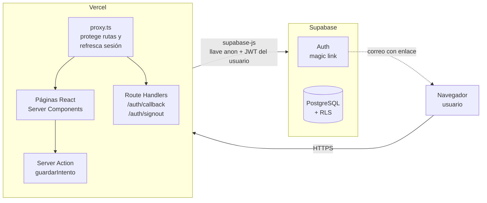
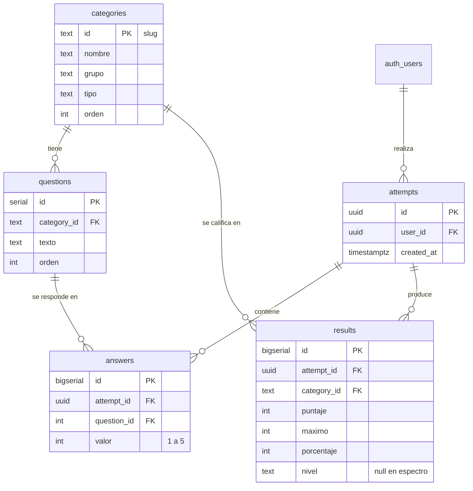
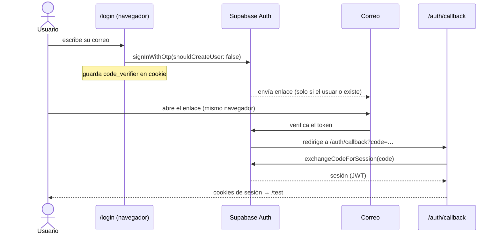
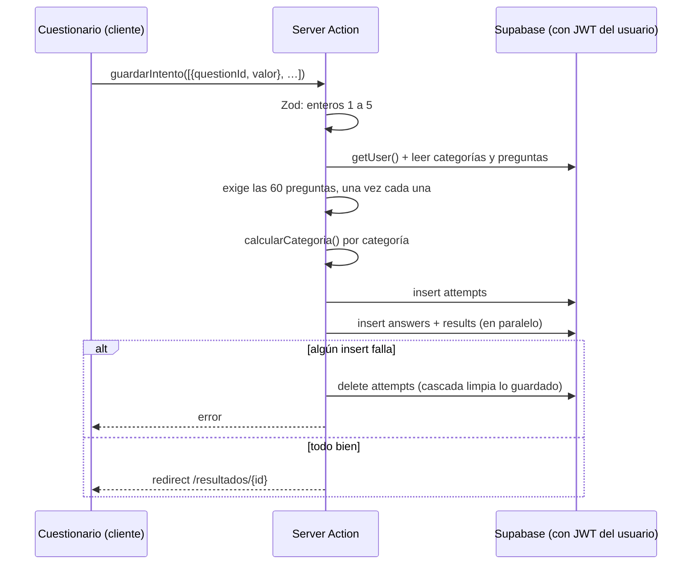
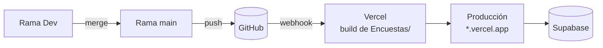

# Arquitectura del MVP: Evaluador de Habilidades Blandas y Estilos de Liderazgo

Documento de arquitectura del MVP. Describe qué se construyó, cómo se conectan las piezas y **por qué** se eligió cada tecnología, incluyendo las alternativas descartadas y las limitaciones conocidas.

> **Origen de las decisiones.** El stack (Next.js, Supabase, Vercel) venía definido en `plan_mvp_encuestas.md`. Este documento explica por qué esa elección tiene sentido para este producto y deja constancia de las decisiones de diseño tomadas durante la construcción (calificación en servidor, RLS, redondeo, espectro, etc.).

---

## 1. Resumen

Aplicación web donde un usuario **autorizado** inicia sesión con un enlace mágico enviado a su correo, responde un test tipo Likert (1 a 5) de 60 preguntas y obtiene un perfil: fortalezas, áreas de mejora, estilo de liderazgo dominante y recomendaciones por categoría.

| Aspecto | Valor |
|---|---|
| Usuarios objetivo del MVP | 2 (el equipo), invitados manualmente |
| Categorías | 12 (7 habilidades, 4 estilos de liderazgo, 1 espectro) |
| Preguntas | 60 (5 por categoría) |
| Servidores propios | Ninguno (todo administrado) |
| Costo del MVP | Planes gratuitos de Vercel y Supabase |

---

## 2. Vista general



Puntos clave:

- El navegador **nunca** habla con la base de datos directamente para guardar resultados: pasa por una Server Action que valida y califica.
- La sesión vive en cookies. El proxy la valida y la renueva en cada petición.
- La seguridad de los datos no depende solo del código de la app: la base de datos aplica **RLS** por su cuenta.

---

## 3. Stack y justificación

### 3.1 Resumen de versiones

| Capa | Tecnología | Versión instalada |
|---|---|---|
| Framework | Next.js (App Router) | 16.3.5 |
| UI | React | 19.2.8 |
| Lenguaje | TypeScript | 5.x |
| Estilos | Tailwind CSS | 4.x |
| Backend / BD / Auth | Supabase (PostgreSQL + Auth) | `supabase-js` 2.116, `@supabase/ssr` 0.12 |
| Validación | Zod | 4.6 |
| Gráficas | Recharts | 3.10 |
| Pruebas | Vitest | 5.0 |
| Hosting | Vercel | Plan Hobby |

### 3.2 Por qué Next.js

**Problema a resolver:** una app con login, páginas que dependen de la sesión y una operación sensible (calificar y guardar) que no debe confiar en el navegador.

Razones:

1. **Servidor y cliente en un solo proyecto.** Las Server Actions permiten ejecutar la calificación en el servidor sin construir y mantener una API REST aparte. Menos código, menos superficie de errores.
2. **Server Components.** Las páginas `/test` y `/resultados/[id]` consultan Supabase en el servidor con la sesión del usuario y envían HTML ya resuelto. La llave de la BD y la lógica de acceso no viajan al cliente más de lo necesario.
3. **Proxy (antes *middleware*).** Un único punto (`src/proxy.ts`) decide quién entra a qué ruta y renueva la sesión, en lugar de repetir la comprobación en cada página.
4. **Integración nativa con Vercel.** Es el mismo equipo detrás de ambos: despliegue sin configuración, previews por rama y variables de entorno en el panel.
5. **TypeScript de punta a punta.** Los tipos de rutas generados (`PageProps<"/resultados/[id]">`) detectan errores de parámetros al compilar.

**Alternativas consideradas**

| Alternativa | Por qué no |
|---|---|
| SPA con Vite + React | Habría que construir un backend aparte para calificar y proteger datos, y manejar la sesión en el cliente. Más piezas para un MVP. |
| Remix / SvelteKit / Nuxt | Igualmente válidos. Next.js gana por la integración con Vercel y por el ecosistema de ejemplos con Supabase. |
| Backend separado (Express/NestJS) + frontend | Doble despliegue, CORS, dos repos o dos builds. Innecesario para dos usuarios. |

**Costo asumido:** Next.js 16 cambia convenciones respecto a versiones anteriores (`middleware` pasó a llamarse `proxy`, `params` es una promesa). Hay que leer la documentación incluida en `node_modules/next/dist/docs/` y no apoyarse en ejemplos antiguos.

### 3.3 Por qué Supabase

**Problema a resolver:** necesitamos autenticación por correo, una base de datos relacional y control de acceso por usuario, sin operar servidores.

Razones:

1. **PostgreSQL real.** Los datos son claramente relacionales (categorías → preguntas → respuestas → resultados). Se pueden imponer con la propia BD: claves foráneas, `unique (attempt_id, question_id)`, `check (valor between 1 and 5)`.
2. **Auth incluido.** El *magic link* viene resuelto: envío del correo, expiración, PKCE y control de registro. La opción de **desactivar el registro abierto** cubre el requisito de "solo correos autorizados" sin escribir código.
3. **Row Level Security (RLS).** Cada tabla declara quién puede ver o modificar qué filas (`user_id = auth.uid()`). La regla vive en la base de datos, así que un error en la app no expone datos de otro usuario.
4. **Plan gratuito suficiente** para el MVP y crecimiento posterior sin migrar de motor.
5. **Salida abierta.** Es PostgreSQL estándar: el esquema (`supabase/schema.sql`) puede llevarse a otro proveedor.

**Alternativas consideradas**

| Alternativa | Por qué no |
|---|---|
| Firebase (Firestore) | Modelo de documentos: los cálculos y relaciones entre categorías, preguntas y resultados son más naturales en SQL. Además, mayor dependencia del proveedor. |
| PostgreSQL propio + Prisma + Auth.js / Clerk | Más control, pero hay que alojar la BD, configurar el envío de correos y montar la autenticación. Mucho trabajo para 2 usuarios. |
| SQLite / archivos | No sirve en un entorno serverless como Vercel (sin disco persistente). |

### 3.4 Por qué Vercel

1. **Despliegue con `git push`.** Cada push a `main` publica producción; cada rama genera una *preview*.
2. **Serverless.** No hay servidor que mantener, parchear ni escalar. El código de servidor de Next.js (páginas dinámicas, Server Actions, proxy) se ejecuta como funciones.
3. **Variables de entorno por entorno**, sin subir secretos al repositorio.
4. **HTTPS y dominio** incluidos. Necesario para cookies de sesión seguras.
5. **Coste cero** para este volumen.

**Alternativas consideradas:** Netlify o Cloudflare Pages (viables, pero con más fricción para las funciones de servidor de Next.js), y un VPS propio (control total, pero se asume la administración del servidor sin necesidad).

**Costo asumido:** dependencia de la plataforma para las funciones de servidor. Next.js puede alojarse en otros lugares (Node, Docker), por lo que el riesgo es moderado.

### 3.5 Otras piezas

| Pieza | Motivo |
|---|---|
| **Tailwind CSS** | Estilos junto al componente, sin archivos CSS que sincronizar; rápido para un MVP. |
| **Zod** | Valida en el servidor lo que llega del navegador (enteros 1 a 5, lista de respuestas). El tipo TypeScript se deriva del mismo esquema. |
| **Recharts** | Gráfica radar declarativa para React, suficiente para el perfil. Es un componente de cliente. |
| **Vitest** | La lógica de calificación es pura y crítica: se prueba de forma aislada y rápida (18 pruebas, incluidos los bordes 40/41, 70/71, 85/86). |

---

## 4. Estructura del código

```
Encuestas/
├── src/
│   ├── proxy.ts                     # Entrada del proxy (matcher de rutas)
│   ├── app/
│   │   ├── page.tsx                 # Redirige a /test
│   │   ├── login/                   # Formulario de magic link
│   │   ├── auth/callback/route.ts   # Cambia ?code= por sesión
│   │   ├── auth/signout/route.ts    # Cierra sesión
│   │   ├── test/
│   │   │   ├── page.tsx             # Carga preguntas (servidor)
│   │   │   └── actions.ts           # Server Action: valida, califica y guarda
│   │   └── resultados/[id]/page.tsx # Muestra el perfil
│   ├── components/                  # Pregunta, Cuestionario, RadarPerfil, TarjetaCategoria
│   ├── data/recomendaciones.ts      # Textos por categoría y nivel
│   └── lib/
│       ├── scoring.ts               # Lógica de calificación (pura)
│       ├── validation.ts            # Esquemas Zod
│       └── supabase/                # client.ts, server.ts, proxy.ts
├── supabase/schema.sql              # Tablas, permisos, RLS y semilla
└── docs/arquitectura.md
```

**Principio de separación:** la lógica de negocio (`scoring.ts`) no importa Next.js ni Supabase. Eso permite probarla sin levantar nada y reutilizarla si el frontend cambia.

---

## 5. Modelo de datos



Decisiones de modelado:

- **`categories.id` es un texto (slug)**, como `comunicacion`. Es legible en consultas y sirve como clave para `recomendaciones.ts`.
- **`categories.tipo`** distingue `nivel` de `espectro`. Así el mismo modelo soporta la categoría Introvertido/Extrovertido sin casos especiales en el esquema.
- **`results` guarda el cálculo, no solo se recalcula.** Es una *instantánea*: si mañana cambian las preguntas o la fórmula, los resultados históricos no se alteran. El costo es duplicar información derivable de `answers`.
- **Integridad en la BD:** `valor` entre 1 y 5, una respuesta por pregunta y por intento, un resultado por categoría y por intento.
- **Cascada:** borrar un `attempt` elimina sus `answers` y `results`. Se usa también para deshacer un guardado parcial.

---

## 6. Flujos principales

### 6.1 Inicio de sesión (magic link con PKCE)



- **`shouldCreateUser: false`** y el registro abierto desactivado garantizan que solo entren correos invitados.
- **PKCE:** el enlace por sí solo no basta. El intercambio necesita una cookie creada en el navegador que pidió el enlace. Por eso el enlace debe abrirse en **el mismo navegador**.
- **Tolerancia:** si Supabase redirige a otra ruta con `?code=` (por ejemplo la Site URL), el proxy lo reenvía a `/auth/callback` en lugar de perderlo.

### 6.2 Protección de rutas

`src/lib/supabase/proxy.ts` se ejecuta antes de cada petición:

1. Llama a `supabase.auth.getUser()`, que **valida el token contra Supabase** (no solo lo lee de la cookie) y refresca la sesión si hace falta.
2. Sin usuario y en ruta no pública → redirige a `/login`.
3. Con usuario en `/login` → redirige a `/test`.
4. Rutas públicas: `/login` y `/auth/*`.

### 6.3 Guardar una evaluación



**Por qué se califica en el servidor:** el navegador solo envía `questionId` y `valor`. Los porcentajes y niveles los calcula el servidor. Un usuario no puede fabricar resultados enviando números distintos a sus respuestas.

---

## 7. Lógica de calificación

Implementada en `src/lib/scoring.ts`, sin dependencias externas.

```
máximo      = nº de preguntas × 5
porcentaje  = round(puntaje / máximo × 100)      ← entero más cercano
nivel       = Bajo ≤ 40 · Medio ≤ 70 · Bueno ≤ 85 · Excelente > 85
```

Decisiones tomadas y aprobadas:

| Tema | Decisión | Razón |
|---|---|---|
| Redondeo | Al entero más cercano; el nivel se calcula con el valor redondeado | El ejemplo del requerimiento truncaba (66,67 % → 66 %). Redondear es más justo y consistente. |
| Rango mínimo | Con escala 1 a 5 el mínimo real es 20 % | Se documenta; no se altera la fórmula. |
| Introvertido/Extrovertido | Espectro normalizado a 0 a 100 (todo en 1 = 0 %, todo en 5 = 100 %), **sin nivel** | Son dos polos, no una escala de calidad. |
| Fortalezas y mejoras | Se toman solo de las 7 **habilidades** | Los estilos de liderazgo son preferencias, no algo que se tenga "de más" o "de menos". |
| Estilo dominante | El de mayor porcentaje entre los 4 estilos | Según el requerimiento. |
| Empates | Gana la categoría con menor `orden` | Resultado determinista. |

---

## 8. Seguridad

### 8.1 Capas

| Capa | Mecanismo |
|---|---|
| Acceso a la app | Registro abierto desactivado + `shouldCreateUser: false` + invitación manual |
| Rutas | Proxy con `getUser()` (token validado, no solo leído) |
| Datos | RLS en las 5 tablas |
| Permisos SQL | `GRANT` explícito solo a `authenticated`; **`anon` no tiene acceso** |
| Entrada | Zod en el servidor + `check` y `unique` en la BD |
| Secretos | `.env.local` fuera de git; solo la llave `anon` en la app |

### 8.2 RLS y permisos

- `categories` y `questions`: lectura para usuarios autenticados.
- `attempts`: el usuario solo ve y crea los suyos (`user_id = auth.uid()`).
- `answers` y `results`: acceso solo si el intento pertenece al usuario (subconsulta a `attempts`).
- El proyecto de Supabase **no concede privilegios automáticamente**; por eso `schema.sql` incluye los `GRANT`. Sin ellos, RLS ni siquiera llega a evaluarse (error `42501`).
- Se verificó que una consulta con la llave `anon` y sin sesión es rechazada.

### 8.3 La llave `anon` es pública por diseño

La variable `NEXT_PUBLIC_SUPABASE_ANON_KEY` viaja al navegador. Eso es esperado: por sí sola no da acceso a datos, porque RLS y los permisos lo impiden. La llave `service_role` **no se usa** y nunca debe estar en el frontend, en Vercel ni en el repositorio.

---

## 9. Despliegue



Configuración necesaria:

1. **Root Directory = `Encuestas`.** El repositorio contiene la app en una subcarpeta.
2. **Variables en Vercel:** `NEXT_PUBLIC_SUPABASE_URL` y `NEXT_PUBLIC_SUPABASE_ANON_KEY`. Se incrustan al compilar: si cambian, hay que **redesplegar**.
3. **Supabase → Authentication → URL Configuration:**
   - *Site URL:* la URL de Vercel, sin barra final.
   - *Redirect URLs:* `https://<app>.vercel.app/**` y `http://localhost:3000/**`.
4. **Ramas:** `main` publica producción. Las demás ramas generan *previews*, que por defecto exigen sesión de Vercel para verlas.

---

## 10. Decisiones de diseño relevantes

| Decisión | Alternativa | Motivo |
|---|---|---|
| Server Action para guardar | Insertar desde el navegador con supabase-js | Permite calificar y validar en el servidor sin exponer la lógica ni aceptar puntajes del cliente. |
| Guardar resultados calculados | Recalcularlos siempre desde `answers` | Instantánea estable ante cambios futuros de preguntas o fórmula. |
| Cuestionario en 12 pasos | Una sola página de 60 preguntas | Menos abrumador, progreso visible; el estado vive en el cliente hasta enviar. |
| Recomendaciones en código (`recomendaciones.ts`) | Tabla en la BD | Son 44 textos que cambian poco; en código se versionan y no requieren un panel de edición. |
| Escribir en `attempts` primero y compensar con `delete` | Transacción SQL (función RPC) | Suficiente para el MVP (ver limitaciones). |

---

## 11. Limitaciones conocidas

1. **Guardado no atómico.** `attempts`, `answers` y `results` se insertan en llamadas separadas; si una falla se borra el intento. Si el proceso muere justo en medio, podría quedar un intento incompleto. Solución futura: una función SQL (RPC) que haga todo en una transacción.
2. **Límite de correos.** El envío gratuito de Supabase permite muy pocos correos por hora. Ya ocurrió en las pruebas (error HTTP 429). Para más usuarios hay que configurar un SMTP propio (por ejemplo Resend).
3. **El mensaje de error del login es genérico**, y agrupa el 429 con otras causas. Pendiente mostrar el motivo real.
4. **Todas las preguntas están redactadas en positivo**, incluidas las de introversión/extroversión (100 % = extrovertido). No hay ítems invertidos, así que un usuario que responde "5" a todo obtiene el máximo en todo (sesgo de aquiescencia).
5. **Los estilos de liderazgo usan niveles Bajo/Medio/Bueno/Excelente** que aquí significan "cuánto se usa el estilo", no calidad. Los colores 🔴/🟢 pueden inducir a error.
6. **Sin roles ni panel de administración.** Las invitaciones se hacen a mano en Supabase.
7. **Sin limitación de intentos** ni protección contra automatización, más allá de la autenticación.
8. **Sin datos de contexto** (equipo, empresa, fecha de nacimiento): un usuario = una identidad.
9. **Categorías y preguntas** fueron propuestas para el MVP y deben validarse con el requerimiento y con un experto antes de un uso serio. El instrumento no está validado psicométricamente.
10. **Sin pruebas de integración ni E2E.** Solo la lógica de calificación tiene pruebas automáticas.

---

## 12. Evolución (fase 2)

Fuera del MVP, ya previsto por la arquitectura:

| Necesidad | Cómo encaja |
|---|---|
| Reporte PDF | `@react-pdf/renderer` en una ruta del servidor, leyendo `results` |
| Historial y seguimiento | `attempts` ya guarda `created_at`; falta la pantalla de comparación |
| Planes empresariales | Añadir tabla `organizations` y `memberships`; ampliar RLS por organización |
| Pagos | Stripe con webhooks en Route Handlers |
| Correos de marca | Resend como SMTP de Supabase |
| Transacción de guardado | Función SQL `guardar_intento()` invocada por RPC |
| Ítems invertidos | Columna `invertida boolean` en `questions` y ajuste en `scoring.ts` |
| Pruebas E2E | Playwright contra un proyecto de Supabase de pruebas |
